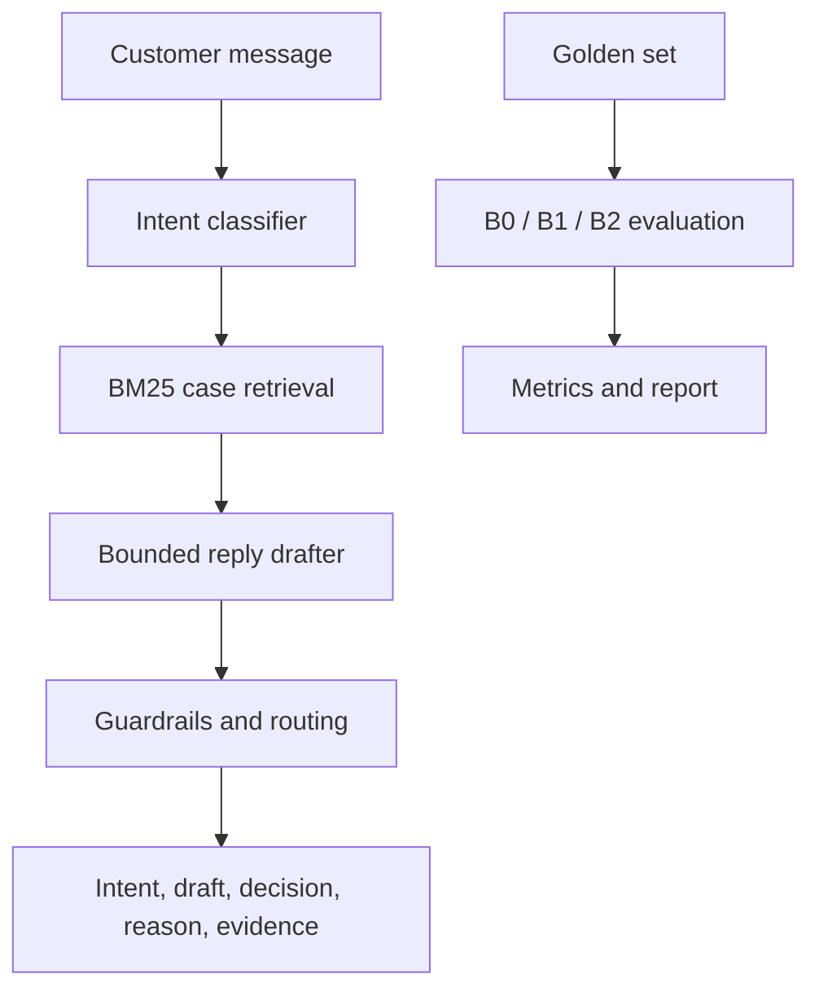

# High-level design

## Goal

Build one AmazonHelp support agent that accepts a customer message and returns:

1. A primary intent.
2. A reply draft grounded in similar historical AmazonHelp conversations.
3. An `AUTO_HANDLE` or `ESCALATE` decision with a reason.

The assignment prioritizes evidence that the system works. The design therefore keeps the runtime small and gives data splitting, baselines, human labels, metrics, and failure analysis equal importance.

## System

The CLI, browser demo, and evaluation harness call the same `SupportOrchestrator`. Retrieval runs in process from a frozen training-only index, so a reviewer needs only Python 3.11.

## Data design

- Read the full Customer Support on Twitter CSV and select `AmazonHelp`.
- Pair each AmazonHelp reply with its inbound customer parent.
- Group by conversation root and split groups chronologically 70/15/15.
- Remove exact repeated customer messages across partitions.
- Redact handles, URLs, phone numbers, emails, postcodes, and order-like identifiers.
- Build the classifier and retrieval index from training only.
- Sample 50 development and 150 test messages from distinct groups.
- Mix 70% random and 30% challenge examples in each golden split.

The bundled index has 5,600 balanced historical cases: 700 for each of eight intents. Training labels are heuristic and visibly marked weak. The 200-example golden set must be reviewed by the candidate and is never silently filled from machine suggestions.

## Runtime decisions

The intent classifier is multinomial Naive Bayes over token counts. BM25 retrieves up to five same-brand historical cases. The offline drafter produces a short intent-specific response using only safe patterns supported by the retrieved examples.

Guardrails escalate messages involving credentials, payments, refunds, cancellation, missing packages, account actions, sensitive data, low intent confidence, inadequate evidence, or invalid generated claims. The system drafts only; it does not contact customers or change accounts.

## Evaluation design

All systems run on the same locked test rows:

| System | Purpose |
| --- | --- |
| B0 | Trivial lower bound: majority intent, fixed response, always escalate |
| B1 | Simple baseline: classifier, one lexical match, simple risk rule |
| B2 | Proposed system: five-case grounding, bounded drafting, deterministic guardrails |

Automated evaluation reports intent macro-F1, accuracy, per-intent scores, auto-handling coverage, unsafe-auto count and rate, safe-auto precision, escalation recall, and latency.

Reply quality is measured on 60 blinded outputs: 20 messages multiplied by three systems. A human and an LLM judge rate groundedness, relevance, helpfulness, tone, privacy violations, unsupported action claims, unsafe instructions, and critical hallucinations. Agreement is reported with weighted kappa and binary kappa.

## Scope boundary

Included: offline dataset processing, intent prediction, historical retrieval, reply drafting, routing, baselines, metrics, judge rubric, report, and decision log.

Excluded: posting tweets, checking accounts, issuing refunds, cancelling orders, retrieving current Amazon policy, and claiming production readiness. Historical 2017 replies are behavioral evidence, not current policy.

